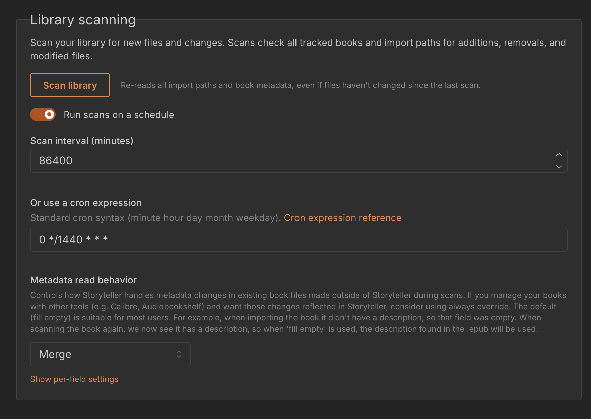
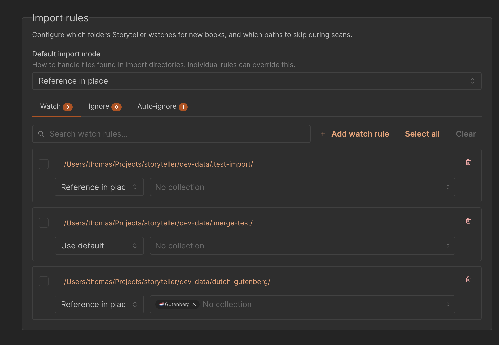
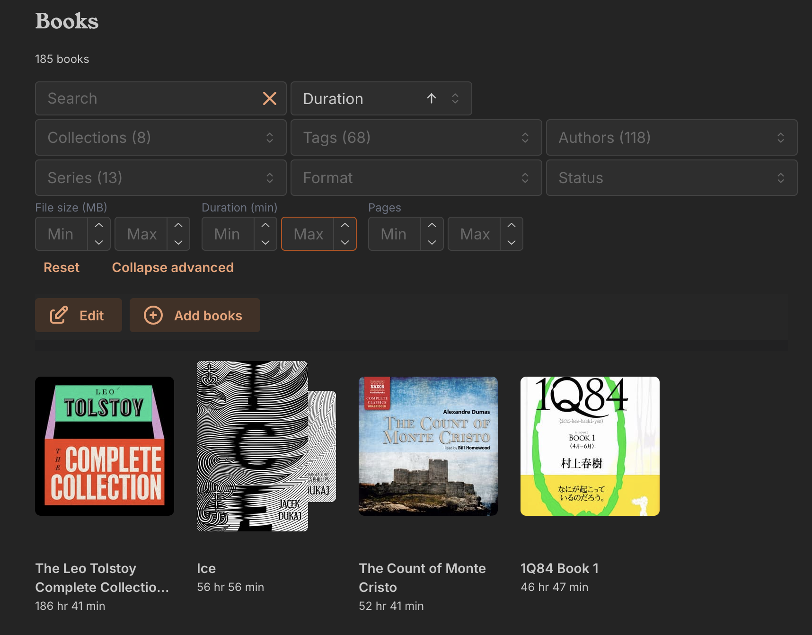

Heya!

After the last
[failed attempt at writing an update blog post](https://gitlab.com/storyteller-platform/storyteller/-/merge_requests/408),
I'll try to keep this one brief so there's actually something to read!

:::tip[TL;DR]

- Much richer metadata from books: sort, filter and, well, actually see the page
  counts and durations of your (audio)books.
- Storyteller can now (re)scan books in your library to pick up changes to the
  files from external sources (Calibre, Audiobookshelf, etc.)
- All auto-import rules have been moved to the settings page. You can set as
  many as you like, add books to multiple collections, and add ignore rules for
  specific folders.
- Simplified file management model. Books in the Storyteller UI now more
  directly correspond to the files in your asset folder. Deleting a book doesn't
  leave a bunch of orphaned files around.
- Advanced file management features: you can now add, replace, and remove
  audiobooks and ebooks to/from existing books.

:::

Read on for more details!

{/* truncate */}

## Reworked scanner

The biggest change in here, which allows for all the other changes to happen,
has been to unify all of the many different ingestion methods Storyteller had
for books into a singular pipeline: the scan.

To you it's probably quite convenient that you could get books into Storyteller
in so many different ways: you can upload books directly, pick a random file on
your server to import, or, what most people probably do, point Storyteller at a
folder on your server and let it scan it for you. While nice, it meant that we
had a lot of different places where we had to handle the same book being
imported in different ways, which made it more costly to add extra data
extraction features.

No more! Now everything flows through a the single scan pipeline, which should
(🤞) make it easier for us to do many more things with books in the future.

One immediate change this brings is that you can now (re)scan books in your
library to pick up changes to the files from external sources (Calibre,
Audiobookshelf, etc.).

By default we will run a once a day rescan of your library to pick up changes to
your files and detect whether files have gone missing, but you can configure how
often this and when this happens using a
[cron expression](https://crontab.guru/). (Note: this scheduled scan is separate
from the auto-import rules and are meant for eg uploaded or manually imported
books, see below)

You can configure how Storyteller handles metadata from book files during scans
using the Metadata Read Behavior setting. By default, Storyteller will merge
existing metadata with the metadata found in the book file. For instance, if you
have added an author to an ebook using Calibre, Storyteller will add that author
to the book in Storyteller, or if you have added a description to the book and
Storyteller did not yet have a description, it will be added. But if you change
the title of the epub, Storyteller will not override its title unless you have
set the behavior to always override.

We will work on making these settings easier to configure in the future, please
let us know what you would like to see in our
[Discord](https://discord.gg/KhSvFqcrza)!

import missingFileImageUrl from "./images/scanner-missing-file.png"

<figure style={{ width: "100%", textAlign: "center" }}>
  
</figure>

Important to know however, is that Storyteller will write metadata changes made
through the UI to your files immediately. In the future we will make this more
configurable.

## Improved auto import

### More stable, more fast

Previously it could take a while for Storyteller to pick up changes to your
files, and could just stop scanning if it encountered an error. Now it's more
stable and faster.

### More flexible folders

Finally, you can now watch multiple folders for new books!

Previously you could also specify a folder to watch for specific Collections.
That setting has now been moved to this new import rules section for ease of
discovery, and you can now put books into multiple collections at once if you
want to.

### Stricter rules, better discovery

While we already told you that
[Every book needs to be in its own folder](https://storyteller-platform.dev/docs/managing/adding#organizing-your-auto-import-folder),
we actually never enforced this until now. This may break some of your existing
auto-import rules, but you shouldn't have been doing it like that to begin with!

With this stricter enforcement, we can now more easily match up new books added
to an existing folder. So now, if you already had a
`/Frankenstein/Frankenstein.epub` file, and you add a new
`/Frankenstein/Frankenstein.m4b` audiobook to it, Storyteller will now
automatically match the new book to the existing one, rather than creating a new
book. Nice!

If you drop in an additional `.epub` in there (which isn't a readaloud epub),
Storyteller will ignore it. If you try to scan a new folder which has > 1 epub
in it, Storyteller will skip it and warn you about it.

### Import modes

You can configure _how_ Storyteller imports books from these folders using the
import mode. This setting isn't new, it was added a while back by
[tecosaur](https://tecosaur.net/)
[MR](https://gitlab.com/storyteller-platform/storyteller/-/merge_requests/471),
but now you can configure it for each folder individually.

There are four import modes to choose from:

- Reference in place: Storyteller will reference the file in the watch folder,
  but not copy it to your libraries assets folder.
- Copy to library: Storyteller will copy the file to your libraries assets
  folder, leaving the original file in the watch folder. The original file will
  be added as an ignore rule (see below)
- Move to library: Storyteller will move the file to your libraries assets
  folder.
- Hard link to library: Storyteller will
  [hard link](https://en.wikipedia.org/wiki/Hard_link) the file to your
  libraries assets folder. The original file will be added as an ignore rule
  (see below).

The move, copy, and hard link modes are more for those who like to make
Storyteller the final arbiter of where files are stored, rather than having to
manage them yourself.

### Ignore rules

The other feature added in that MR was making Storyteller ignore books from
auto-impored folders that you deleted from your library. This was very useful,
but we didn't really have a way to undo this before. You can manage those ignore
rules here as well, in the auto-ignore tab. This is now also an explicit check
when deleting books.

:::warning

There now also is no longer an option to keep any of the files in Storyteller's
assets folder around when deleting a book, so be really sure you want to delete
a book before doing so.

:::

## Richer metadata

As mentioned, Storyteller can now extract page counts and durations from ebooks
and audiobooks. While the page counts are a bit of a guess, they should be the
same as the ones in the Storyteller apps and web reader.

import metadataImageUrl from "./images/scanner-richer-metadata.png"

<figure>
  
  <figcaption style={{ textAlign: "center", fontSize: "0.8rem" }}>
    The duration discrepancy between the readaloud and audiobook can also be
    used as an imperfect proxy for alignment quality. Here we see almost all of
    the content from audiobook is aligned, the difference only being ~1.2%{" "}
  </figcaption>
</figure>

You can also sort and filter by these fields in the library view (not yet in the
mobile apps, coming soon!), making it easier to find a book that matches your
current attention span.

This also shows a new feature in the UI, namely dynamically showing you the
property you are sorting/filtering on (here the duration is shown rather than
the author).

For the those of you that prefer to match the page counts in these views with
the actual page counts in eg your physical book, you can manually set both page
count and duration for a book in the settings of that book. This will then be
used to for sorting and filtering.
